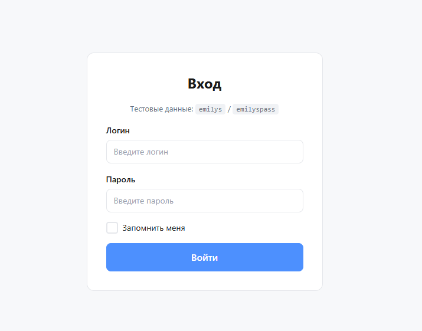
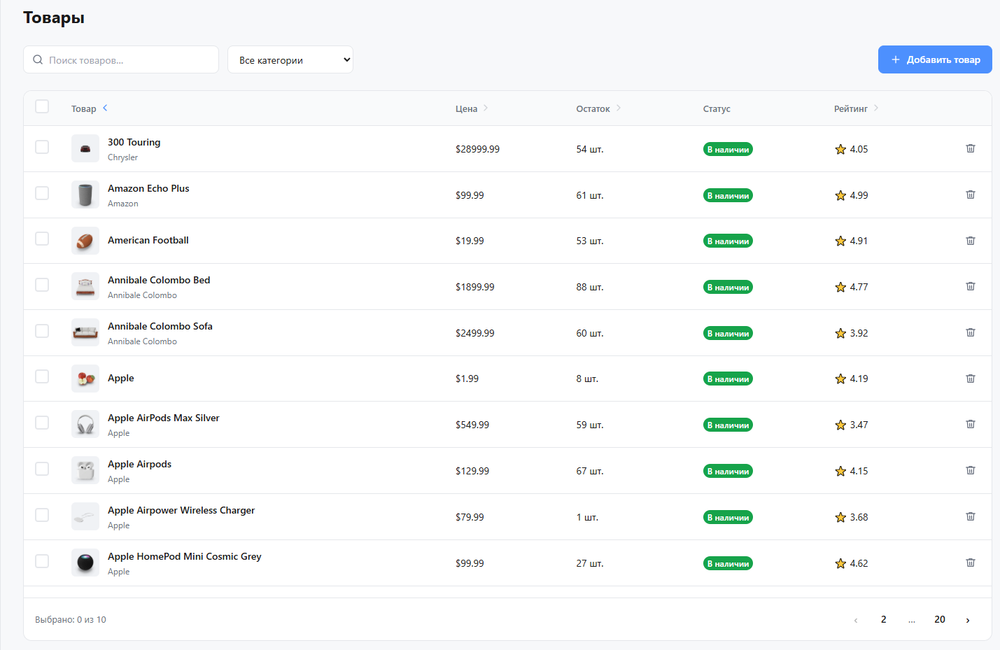
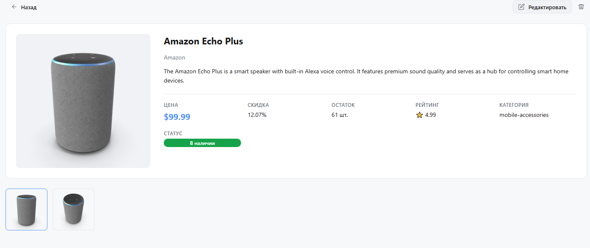

<div align="center">

# 🛍️ Product Admin Panel

**Панель управления товарами с авторизацией, сортировкой, поиском и пагинацией**


[Демо](#демо) • [Быстрый старт](#быстрый-старт) • [Архитектура](#архитектура) • [Функциональность](#функциональность)

</div>

---

## 📋 О проекте

**Product Admin Panel** — это SPA-приложение для управления каталогом товаров, построенное на React + TypeScript с применением архитектуры Feature-Sliced Design (FSD).

Проект решает задачу администрирования товаров: просмотр списка с сортировкой и поиском, просмотр детальной информации, добавление и удаление товаров.

**Для кого:** разработчикам как референс-проект по FSD-архитектуре и современному React-стеку.

---

## 🎬 Демо

> Тестовые данные для входа:
> - **Логин:** `emilys`
> - **Пароль:** `emilyspass`

### Скриншоты

| Страница входа | Список товаров | Карточка товара |
|:-:|:-:|:-:|
|  |  |  |

---

## ✨ Функциональность

### Авторизация
- Форма входа с валидацией полей (обязательность заполнения)
- Обработка ошибок API с выводом сообщения под формой
- Чекбокс **«Запомнить меня»**:
  - ✅ установлен → токен в `localStorage`, сессия живёт после закрытия браузера
  - ❌ не установлен → токен в `sessionStorage`, сессия сбрасывается при закрытии вкладки
- Защита маршрутов: неавторизованные пользователи перенаправляются на `/login`

### Список товаров
- Таблица с колонками: товар, цена, остаток, статус, рейтинг
- **Прогресс-бар** при загрузке данных
- **Сортировка** по столбцам (цена, рейтинг, остаток, название) — состояние сохраняется
- **Поиск** по названию через API (`/products/search?q=...`)
- **Пагинация** с переключением страниц
- Множественный выбор товаров с чекбоксами
- Рейтинг ниже 3 подсвечивается **красным цветом**

### Управление товарами
- **Добавление** — форма с полями: наименование, цена, вендор, артикул; Toast-уведомление при успехе
- **Удаление** — одиночное и массовое с подтверждением
- **Детальная страница** товара с галереей изображений

---

## 🛠 Технологический стек

| Категория | Технология |
|-----------|-----------|
| **UI** | React 19, CSS Modules |
| **Язык** | TypeScript 5 |
| **Состояние** | Redux Toolkit, createAsyncThunk |
| **Роутинг** | React Router 6 (createBrowserRouter) |
| **HTTP** | Axios |
| **Сборка** | Vite 6 |
| **Архитектура** | Feature-Sliced Design (FSD) |
| **API** | [DummyJSON](https://dummyjson.com/docs/products) |

---

## 🚀 Быстрый старт

### Требования

- **Node.js** ≥ 18
- **npm** ≥ 9

### Установка и запуск

```bash
# Клонировать репозиторий
git clone https://github.com/your-username/product-admin-panel.git
cd product-admin-panel

# Установить зависимости
npm install

# Запустить dev-сервер
npm run dev
```

Приложение будет доступно по адресу: `http://localhost:5173`

### Другие команды

```bash
npm run build      # Сборка для продакшена
npm run preview    # Предпросмотр продакшен-сборки
npm run lint       # Проверка линтером
```

---

## 🏗 Архитектура

Проект построен по методологии **[Feature-Sliced Design](https://feature-sliced.design/)** — архитектурному стандарту для фронтенд-приложений.

```
src/
├── app/                    # Инициализация приложения
│   ├── styles/             # Глобальные стили и CSS-переменные
│   ├── App.tsx             # Корневой компонент с Provider'ами
│   ├── router.tsx          # Конфигурация маршрутов
│   ├── store.ts            # Redux store
│   └── hooks.ts            # Типизированные хуки
│
├── pages/                  # Страницы (композиция виджетов)
│   ├── login/              # Страница авторизации
│   ├── products/           # Список товаров
│   ├── product-detail/     # Детальная страница товара
│   ├── product-create/     # Создание товара
│   ├── product-edit/       # Редактирование товара
│   └── not-found/          # 404
│
├── widgets/                # Крупные составные блоки UI
│   ├── layout/             # AppLayout + Sidebar
│   ├── product-table/      # Таблица товаров
│   └── product-toolbar/    # Панель действий (поиск, кнопки)
│
├── features/               # Пользовательские сценарии
│   ├── auth-guard/         # Защита маршрутов
│   ├── product-search/     # Поиск товаров
│   ├── product-sort/       # Сортировка по столбцам
│   └── product-delete/     # Удаление товаров
│
├── entities/               # Бизнес-сущности
│   ├── product/            # Товар (slice, selectors, UI-строка)
│   └── session/            # Сессия (авторизация, токены)
│
├── shared/                 # Переиспользуемый код
│   ├── api/                # Axios-клиент, API-модули
│   ├── ui/                 # UI-kit (Button, Input, Table, Toast...)
│   ├── lib/                # Утилиты (cn, debounce)
│   ├── config/             # Маршруты, константы
│   └── assets/             # Иконки (SVG-компоненты)
│
└── main.tsx                # Точка входа
```

### Принципы FSD

| Правило | Описание |
|---------|----------|
| **Однонаправленные зависимости** | `app → pages → widgets → features → entities → shared` |
| **Public API** | Каждый модуль экспортирует только через `index.ts` |
| **Изоляция слоёв** | Слой не импортирует из слоёв выше себя |
| **Слабая связанность** | Features и entities не знают друг о друге напрямую |

---

## 📁 UI-компоненты (shared/ui)

| Компонент | Описание |
|-----------|----------|
| `Button` | Кнопка с вариантами: primary, secondary, danger, ghost |
| `IconButton` | Кнопка-иконка |
| `Input` | Текстовое поле с поддержкой иконок |
| `Checkbox` | Чекбокс с indeterminate-состоянием |
| `Badge` | Статусный бейдж (success, warning, danger) |
| `Icon` | Обёртка для SVG-иконок с размерами |
| `Table` | Семейство компонентов таблицы |
| `Pagination` | Пагинация с номерами страниц |
| `Spinner` | Анимированный индикатор загрузки |
| `ProgressBar` | Полоса загрузки в верхней части экрана |
| `Toast` | Всплывающее уведомление |

---

## 🔌 API

Приложение использует [DummyJSON API](https://dummyjson.com/):

| Метод | Endpoint | Описание |
|-------|----------|----------|
| `POST` | `/auth/login` | Авторизация |
| `GET` | `/auth/me` | Проверка сессии |
| `GET` | `/products` | Список товаров (пагинация, сортировка) |
| `GET` | `/products/search?q=` | Поиск товаров |
| `GET` | `/products/:id` | Детали товара |
| `DELETE` | `/products/:id` | Удаление товара |

---

## 📌 Дорожная карта

- [x] Авторизация с «Запомнить меня»
- [x] Таблица товаров с сортировкой и поиском
- [x] Пагинация
- [x] Удаление товаров (одиночное и массовое)
- [x] Форма добавления товара
- [x] Toast-уведомления
- [ ] Форма редактирования товара
- [ ] Тёмная тема
- [ ] Unit-тесты (Vitest + Testing Library)
- [ ] E2E-тесты (Playwright)
- [ ] Storybook для UI-компонентов
- [ ] CI/CD pipeline

---

## 📄 Лицензия

Этот проект распространяется под лицензией [MIT](LICENSE).

---
